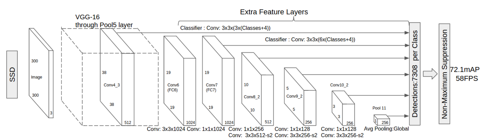

# Self-Driving Car System Integration: Team Danya

### Team
Hossam Ashtawy: hossam.ashtawy@gmail.com

### Overview

This is the project repo for the final project of the Udacity Self-Driving Car Nanodegree: Programming a Real Self-Driving Car. 

### System Arcitecture

The following is a system architecture diagram showing the ROS nodes and topics used in the project. The ROS nodes and topics shown in the diagram are described briefly in the sections below, and more detail is provided for each node in the code.

<p align="center">
  
</p>

#### /ros/src/tl_detector/
This package contains the traffic light detection node: **tl_detector.py**. This node takes in data from the **/image_color**, **/current_pose**, and **/base_waypoints** topics and publishes the locations to stop for red traffic lights to the **/traffic_waypoint** topic.

The **/current_pose** topic provides the vehicle's current position, and **/base_waypoints** provides a complete list of waypoints the car will be following.

You will build both a traffic light detection node and a traffic light classification node. Traffic light detection should take place within **tl_detector.py**, whereas traffic light classification should take place within **../tl_detector/light_classification_model/tl_classfier.py**.

<p align="center">
  
</p>

The classifier used in this project to detect the traffic light state is based on the model [ssd_mobilenet_v1_coco](https://github.com/tensorflow/models/blob/master/research/object_detection/g3doc/detection_model_zoo.md#tensorflow-detection-model-zoo) from the model zoo of the [TensorFlow Object Detection API](https://github.com/tensorflow/models/tree/master/research/object_detection). The model is pre-trained on the [COCO dataset](http://cocodataset.org) and then finetuned for traffic sign detection and classification on [traffic lights dataset](https://drive.google.com/file/d/0B-Eiyn-CUQtxdUZWMkFfQzdObUE/view). The model's small inference time (<50ms) and high accuracy are the main reasons for choosing it to run in real time in the simulator and the car.   

<p align="center">
  
</p>
https://towardsdatascience.com/deep-learning-for-object-detection-a-comprehensive-review-73930816d8d9

####/ros/src/waypoint_updater/
This package contains the waypoint updater node: **waypoint_updater.py**. The purpose of this node is to update the target velocity property of each waypoint based on traffic light and obstacle detection data. This node will subscribe to the **/base_waypoints**, **/current_pose**, **/obstacle_waypoint**, and **/traffic_waypoint** topics, and publish a list of waypoints ahead of the car with target velocities to the **/final_waypoints** topic.

<p align="center">
  
</p>

#### /ros/src/twist_controller/
Carla is equipped with a drive-by-wire (dbw) system, meaning the throttle, brake, and steering have electronic control. This package contains the files that are responsible for control of the vehicle: the node dbw_node.py and the file **twist_controller.py**, along with a pid and lowpass filter that you can use in your implementation. The dbw_node subscribes to the **/current_velocity** topic along with the **/twist_cmd** topic to receive target linear and angular velocities. Additionally, this node will subscribe to **/vehicle/dbw_enabled**, which indicates if the car is under dbw or driver control. This node will publish throttle, brake, and steering commands to the **/vehicle/throttle_cmd**, **/vehicle/brake_cmd**, and **/vehicle/steering_cmd** topics.

<p align="center">
  
</p>

In addition to these packages you will find the following, which are not necessary to change for the project. The **styx** and **styx_msgs** packages are used to provide a link between the simulator and ROS, and to provide custom ROS message types:

*   **/ros/src/styx/**
A package that contains a server for communicating with the simulator, and a bridge to translate and publish simulator messages to ROS topics.
*   **/ros/src/styx_msgs/**
A package which includes definitions of the custom ROS message types used in the project.
*   **/ros/src/waypoint_loader/**
A package which loads the static waypoint data and publishes to **/base_waypoints**.
*   **/ros/src/waypoint_follower/**
A package containing code from [Autoware](https://github.com/CPFL/Autoware) which subscribes to **/final_waypoints** and publishes target vehicle linear and angular velocities in the form of twist commands to the **/twist_cmd** topic.

Please use **one** of the two installation options, either native **or** docker installation.

### Native Installation

* Be sure that your workstation is running Ubuntu 16.04 Xenial Xerus or Ubuntu 14.04 Trusty Tahir. [Ubuntu downloads can be found here](https://www.ubuntu.com/download/desktop).
* If using a Virtual Machine to install Ubuntu, use the following configuration as minimum:
  * 2 CPU
  * 2 GB system memory
  * 25 GB of free hard drive space

  The Udacity provided virtual machine has ROS and Dataspeed DBW already installed, so you can skip the next two steps if you are using this.

* Follow these instructions to install ROS
  * [ROS Kinetic](http://wiki.ros.org/kinetic/Installation/Ubuntu) if you have Ubuntu 16.04.
  * [ROS Indigo](http://wiki.ros.org/indigo/Installation/Ubuntu) if you have Ubuntu 14.04.
* [Dataspeed DBW](https://bitbucket.org/DataspeedInc/dbw_mkz_ros)
  * Use this option to install the SDK on a workstation that already has ROS installed: [One Line SDK Install (binary)](https://bitbucket.org/DataspeedInc/dbw_mkz_ros/src/81e63fcc335d7b64139d7482017d6a97b405e250/ROS_SETUP.md?fileviewer=file-view-default)
* Download the [Udacity Simulator](https://github.com/udacity/CarND-Capstone/releases).

### Docker Installation
[Install Docker](https://docs.docker.com/engine/installation/)

Build the docker container
```bash
docker build . -t capstone
```

Run the docker file
```bash
docker run -p 4567:4567 -v $PWD:/capstone -v /tmp/log:/root/.ros/ --rm -it capstone
```

### Port Forwarding
To set up port forwarding, please refer to the [instructions from term 2](https://classroom.udacity.com/nanodegrees/nd013/parts/40f38239-66b6-46ec-ae68-03afd8a601c8/modules/0949fca6-b379-42af-a919-ee50aa304e6a/lessons/f758c44c-5e40-4e01-93b5-1a82aa4e044f/concepts/16cf4a78-4fc7-49e1-8621-3450ca938b77)

### Udacity Workspace
Make sure you do the following to avoid errors related dbw mkz messages:
```bash
sudo apt-get update
sudo apt-get install -y ros-kinetic-dbw-mkz-msgs
cd /home/workspace/CarND-Capstone/ros
rosdep install --from-paths src --ignore-src --rosdistro=kinetic -y
pip install --upgrade catkin_pkg_modules
```

### Usage

1. Clone the project repository
```bash
git clone https://github.com/udacity/CarND-Capstone.git
```

2. Install python dependencies
```bash
cd CarND-Capstone
pip install -r requirements.txt
```
3. Make and run styx
```bash
cd ros
catkin_make
source devel/setup.sh
roslaunch launch/styx.launch
```
4. Run the simulator

### Real world testing
1. Download [training bag](https://s3-us-west-1.amazonaws.com/udacity-selfdrivingcar/traffic_light_bag_file.zip) that was recorded on the Udacity self-driving car.
2. Unzip the file
```bash
unzip traffic_light_bag_file.zip
```
3. Play the bag file
```bash
rosbag play -l traffic_light_bag_file/traffic_light_training.bag
```
4. Launch your project in site mode
```bash
cd CarND-Capstone/ros
roslaunch launch/site.launch
```

#### Running ROS bag on the Udacity Workspace
Navigate to a temporary storage folder, so as not to exceed the 2GB limit in /home/workspace. 

1. Download the [ros bag] (https://s3-us-west-1.amazonaws.com/udacity-selfdrivingcar/traffic_light_bag_file.zip) using wget and the download link and unzip the file:
```bash
cd /opt
wget <link_to_your_download>
unzip /opt/path/to/your/download.zip
```
2. Open a terminal and start roscore.
3. Open another terminal and run **rosbag play -l /opt/path/to/your.bag**
4. Click the "Go To Desktop" button.
5. From the XWindows desktop, open terminator, and run rviz. You can change the RViz configuration to Udacity's .config file by navigating to /home/workspace/default.rviz from File > Open Config in RViz.
6. Confirm that traffic light detection works on real life images
